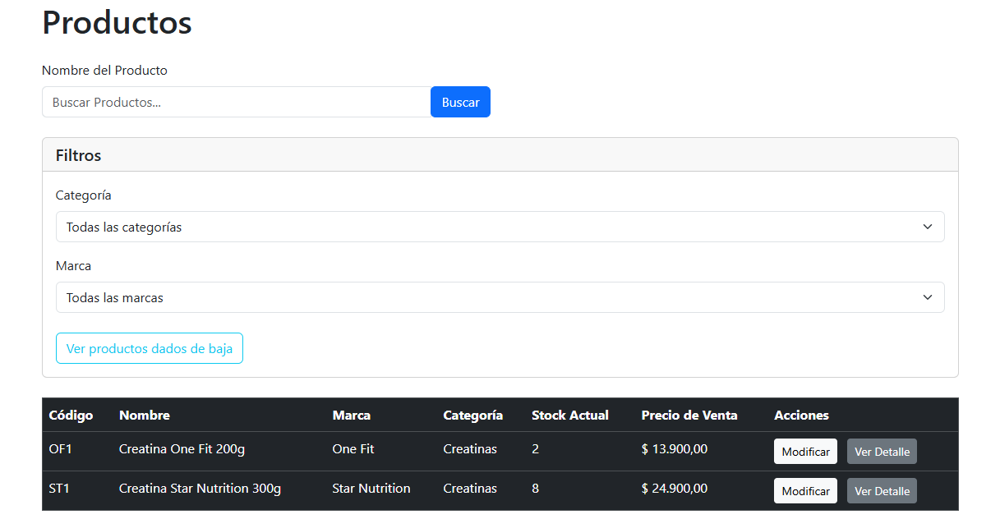
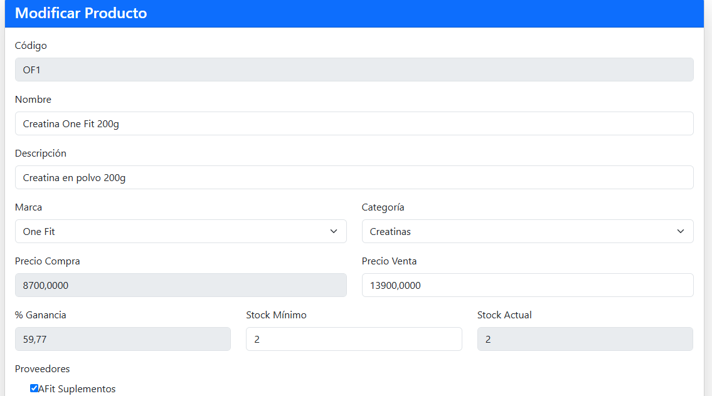
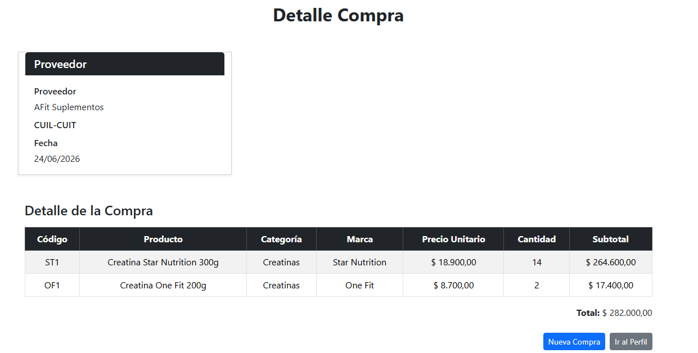
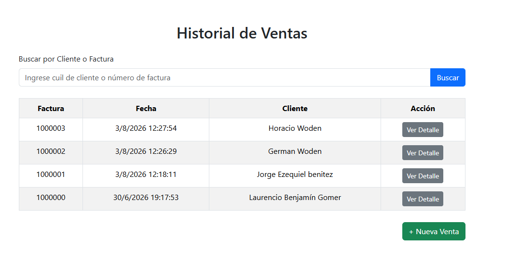
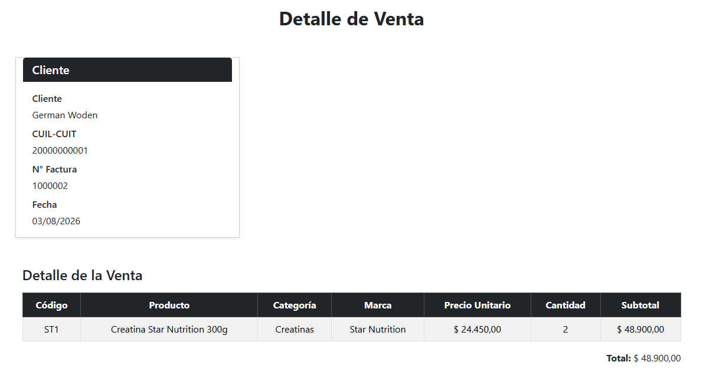

# Sistema Back Office para Gestión Comercial

Aplicación web desarrollada en C# con ASP.NET Web Forms y SQL Server para administrar productos, clientes, proveedores, compras, ventas, stock y precios dentro de un comercio minorista.

El sistema fue construido como proyecto académico y luego extendido con reglas de negocio reales, tomando como caso de uso un comercio de suplementos. Aun así, la estructura puede adaptarse a otros rubros que trabajen con productos, proveedores, compras, ventas e inventario.

## Funcionalidades

- Gestión de productos, marcas y categorías.
- Gestión de clientes y proveedores.
- Registro de compras a proveedores.
- Registro de ventas a clientes.
- Actualización automática de stock.
- Consulta de ventas y compras registradas.
- Detalle de operaciones con productos, cantidades, precios unitarios y subtotales.
- Baja lógica y reactivación de productos.
- Sistema de usuarios con distintos niveles de acceso.

## Reglas de Negocio Implementadas

- El stock aumenta cuando se registra una compra.
- El stock disminuye cuando se registra una venta.
- El sistema valida que no se pueda vender una cantidad mayor al stock disponible.
- Cada venta guarda el precio unitario real cobrado, preservando el historial aunque el precio de lista del producto cambie.
- El precio de venta del producto representa el precio de lista actual.
- El precio de compra se actualiza a partir de las compras registradas.
- La ganancia se calcula a partir del precio de compra y el precio de venta.
- Los productos se eliminan de forma lógica para conservar el historial de operaciones.
- Los proveedores pueden buscarse por nombre para facilitar la carga de compras.

## Tecnologías Utilizadas

- C#
- .NET Framework
- ASP.NET Web Forms
- SQL Server
- ADO.NET
- Bootstrap
- Git y GitHub
- Visual Studio

## Arquitectura

El proyecto está organizado en una arquitectura de tres capas:

- `dominio`: contiene las entidades principales del sistema, como `Producto`, `Cliente`, `Proveedor`, `Compra`, `Venta` e `ItemVenta`.
- `negocio`: contiene la lógica de negocio, validaciones y acceso a datos.
- `presentacion`: contiene las pantallas Web Forms y el flujo de interacción con el usuario.

Esta separación permite mantener más ordenado el código y diferenciar responsabilidades entre modelo, lógica y presentación.

## Base de Datos

El sistema utiliza SQL Server como motor de base de datos.

La carpeta `Database` incluye scripts para crear la base de datos y cargar datos iniciales:

- `COMERCIO_DB.sql`
- `INSERTS_SISTEMA_COMPRAS_VENTAS.sql`
- `INSERTS_SUPLEMENTOS.sql`

La base de datos incluye tablas para productos, clientes, proveedores, usuarios, compras, ventas, detalles de compra, items de venta, marcas y categorías.

También se utilizan stored procedures para algunas operaciones críticas relacionadas con compras, ventas y actualización de stock.

## Capturas del Sistema

> Los datos visibles en las capturas son ficticios y fueron cargados únicamente para pruebas.

### Gestión de productos

Listado de productos con stock actual, marca, categoría, precio de venta y acciones disponibles.



### Modificación de producto

Formulario de modificación con datos comerciales del producto, precio de compra, precio de venta, ganancia, stock y proveedor asociado.



### Detalle de compra

Detalle de una compra registrada, mostrando precio unitario de compra, cantidad, subtotal y total.



### Historial de ventas

Consulta de ventas registradas con número de factura, fecha, cliente y acceso al detalle.



### Detalle de venta

Detalle de una venta registrada, preservando el precio unitario real cobrado en esa operación.



## Requisitos Previos

Para ejecutar el proyecto localmente se necesita:

- Visual Studio
- .NET Framework
- SQL Server o SQL Server Express
- SQL Server Management Studio, opcional pero recomendado
- Git, opcional

## Instalación y Ejecución

1. Clonar el repositorio:

```bash
git clone https://github.com/nicovyv/TPC-Negocio.git
```

2. Abrir la solución en Visual Studio:

```text
TPC-Negocio.sln
```

3. Crear la base de datos ejecutando el script:

```text
Database/COMERCIO_DB.sql
```

4. Opcionalmente, cargar datos de prueba:

```text
Database/INSERTS_SISTEMA_COMPRAS_VENTAS.sql
Database/INSERTS_SUPLEMENTOS.sql
```

5. Revisar la cadena de conexión en:

```text
negocio/AccesoDatos.cs
```

6. Establecer el proyecto `presentacion` como proyecto de inicio.

7. Ejecutar la aplicación desde Visual Studio.

## Estado del Proyecto

Proyecto en desarrollo.

Actualmente el sistema cuenta con los flujos principales de gestión comercial y continúa en mejora, especialmente en aspectos de presentación, validaciones, consistencia de datos, reportes y pruebas.

## Mejoras Futuras

- Reforzar validaciones de precios y cantidades.
- Implementar transacciones completas para compras y ventas.
- Agregar reportes de ventas, compras y rentabilidad.
- Incorporar historial de cambios de precios.
- Agregar tests unitarios para reglas de negocio.
- Mejorar permisos para controlar quién puede modificar precios.
- Configurar la cadena de conexión desde archivo de configuración.
- Mejorar la presentación visual de las capturas del README.

## Aprendizajes del Proyecto

Este proyecto permitió trabajar con un sistema web completo de punta a punta, integrando interfaz, lógica de negocio y base de datos.

Además, permitió pensar decisiones propias de un sistema real, como el manejo de stock, el precio histórico de venta, la diferencia entre precio de lista y precio cobrado, la actualización de precios de compra y la conservación del historial de operaciones.

## Autores

- Nicolás Zabala
- Ezequiel Benítez
- Iván Baigorria

## Contexto

Proyecto desarrollado originalmente como trabajo integrador para Programación III en la Tecnicatura Universitaria en Programación de la UTN FRGP.
